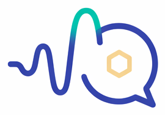
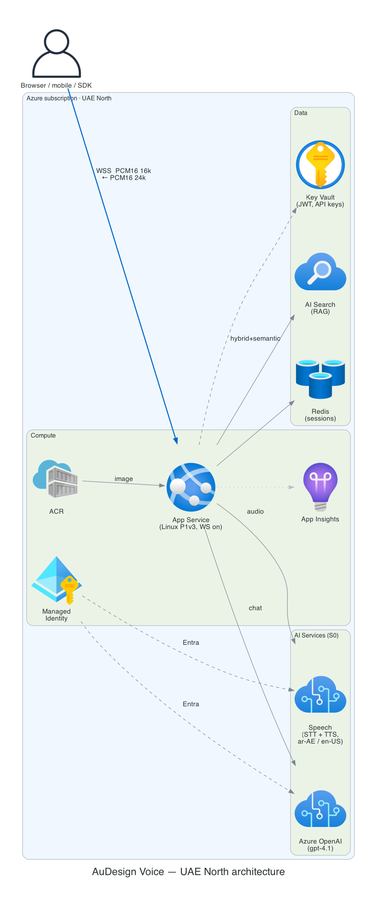
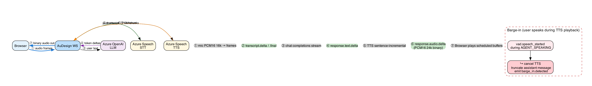
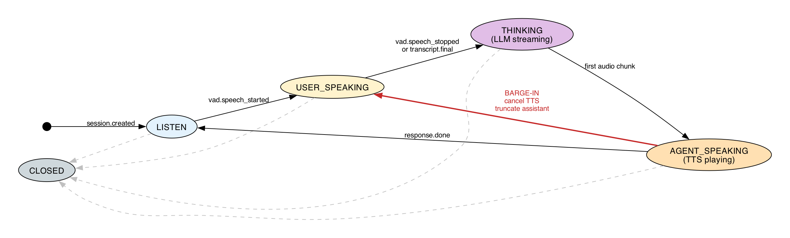
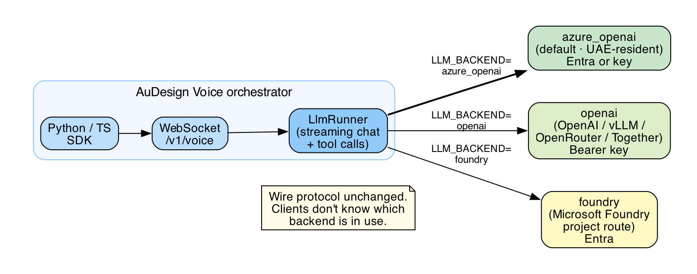
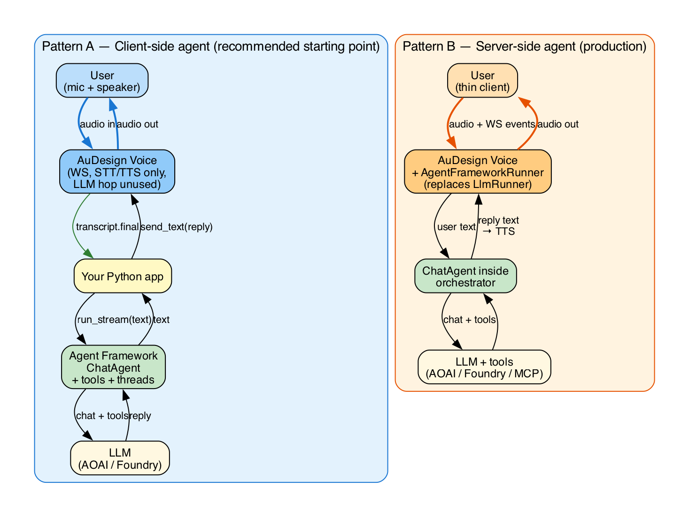

<h1 align="center">
  
  &nbsp;AuDesign Voice
</h1>

> A self-hosted, UAE-North–resident alternative to Azure's Voice Live API. Pluggable LLM. OpenAI / Azure OpenAI / Microsoft Foundry. Python + TypeScript SDKs. **[Full documentation →](https://saadmsft.github.io/audvoice-voice/)**

[](https://github.com/saadmsft/audvoice-voice/actions/workflows/ci.yml)
[](https://saadmsft.github.io/audvoice-voice/)
[](LICENSE)

Chains **Azure Speech (STT/TTS)** with a **pluggable LLM backend** (Azure OpenAI, OpenAI, or Microsoft Foundry) behind a custom WebSocket protocol that any LLM-based application can plug into. Adds the conversational layer Voice Live gives you for free: barge-in, server-side VAD, end-of-turn detection, echo cancellation / noise suppression, tool-call passthrough, and optional VoiceRAG grounding via Azure AI Search.



## Documentation

📖 **[saadmsft.github.io/audvoice-voice](https://saadmsft.github.io/audvoice-voice/)** — full searchable docs site

| Doc                                          | What it covers                                |
| -------------------------------------------- | --------------------------------------------- |
| **[Getting started](docs/getting-started.md)** | Provision Azure, run locally, first call    |
| **[Wire protocol](docs/protocol.md)**          | Every event, audio format, state machine    |
| **[LLM backends](docs/llm-backends.md)**       | AOAI / OpenAI / Foundry, models, latency    |
| **[Agent Framework integration](docs/integration-agent-framework.md)** | Two patterns: client-side and server-side |
| **[SDKs](docs/sdk.md)**                        | Python + TypeScript, publishing             |
| **[Deployment](docs/deployment.md)**           | Bicep + App Service for UAE North           |
| **[Operations & residency](docs/operations.md)** | Quotas, logs, the residency caveat        |

## SDKs

```bash
pip install audvoice-client       # Python (async)
npm  install @audvoice/client     # TypeScript / browser
```

## Repo layout

| Path                    | Purpose                                             |
| ----------------------- | --------------------------------------------------- |
| `apps/orchestrator/`    | FastAPI WebSocket server (the "Voice Live" service) |
| `apps/web-demo/`        | Browser demo (mic → WS → speaker)                   |
| `packages/client_py/`   | Python client SDK (`audvoice-client`)               |
| `packages/client_js/`   | TypeScript client SDK (`@audvoice/client`)          |
| `infra/`                | Bicep templates targeting UAE North                 |
| `docs/`                 | All user-facing documentation + diagrams            |
| `tests/`                | Unit + live integration tests                       |

## 30-second quick start

```bash
az login
az group create -n rg-audvoice -l uaenorth
az deployment group create -g rg-audvoice -f infra/minimal.bicep

cd apps/orchestrator
cp .env.example .env                  # then edit AZURE_OPENAI_ENDPOINT + AZURE_SPEECH_RESOURCE_ID
pip install -e '.[dev]'
uvicorn audvoice.main:app --port 8088
```

In another shell:

```bash
cd apps/web-demo && python3 -m http.server 5173
open http://127.0.0.1:5173
```

Full walkthrough → [docs/getting-started.md](docs/getting-started.md).

## How a turn flows



## Session state machine



## Pluggable LLM backends



## Microsoft Agent Framework



See [docs/integration-agent-framework.md](docs/integration-agent-framework.md) for runnable code for both patterns.

## Status

v1: browser channel, ar-AE/ar-SA/en-US/en-GB with continuous Language ID, pluggable LLM (AOAI / OpenAI / Foundry), single-region App Service, custom WS protocol + Python SDK + TypeScript SDK + browser demo.

Out of scope v1: TTS Avatar (not in UAE North), telephony / ACS-SIP, mobile SDKs, Core42 sovereign deployment, model fine-tuning.

## License

MIT — see [LICENSE](LICENSE).
